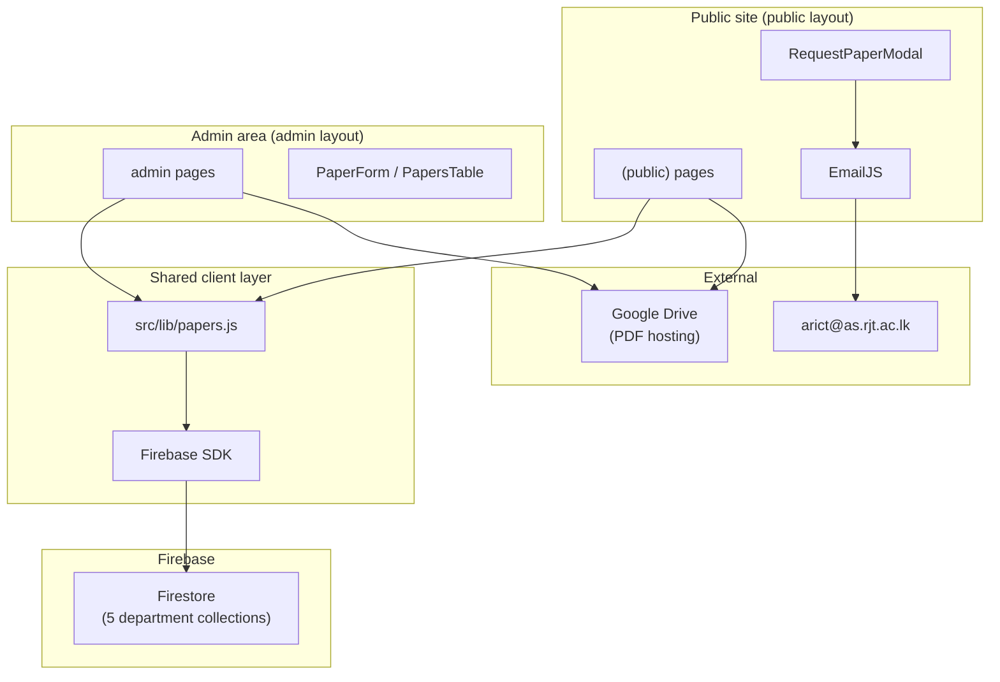

# ARICT Past Paper Portal

A web application for the **Association of Rajarata Information & Communication Technology (ARICT)** that lets students browse, search, and download past examination papers. Papers are stored in **Firebase Firestore** and linked via **Google Drive** URLs. A dedicated **admin** area provides a dashboard and full CRUD for managing papers. Students can also **request missing papers** via an EmailJS-powered form.

---

## Table of Contents

- [Overview](#overview)
- [Features](#features)
- [Tech Stack](#tech-stack)
- [Architecture](#architecture)
- [Project Structure](#project-structure)
- [Routes & Pages](#routes--pages)
- [Data Model (Firestore)](#data-model-firestore)
- [How It Works](#how-it-works)
- [Shared Library (`src/lib/papers.js`)](#shared-library-srclibpapersjs)
- [Environment Variables](#environment-variables)
- [Getting Started](#getting-started)
- [Admin Area](#admin-area)
- [Request a Paper (EmailJS)](#request-a-paper-emailjs)
- [Components](#components)
- [Styling & Design](#styling--design)
- [Fallback Data](#fallback-data)
- [Scripts](#scripts)
- [Deployment](#deployment)
- [Known Limitations](#known-limitations)
- [Contributing & Policies](#contributing--policies)
- [License](#license)

---

## Overview

This is a [Next.js](https://nextjs.org) App Router application that serves as a **past paper archive** for ARICT students.

**Public site** (`src/app/(public)/`):

- Searchable catalog across five academic departments
- Department and examination-period browsing on the home page
- Paper detail pages with Google Drive PDF preview and download
- Static pages (About, Faculty)
- **Request Paper** modal — students submit missing-paper requests by email

**Admin area** (`src/app/admin/`):

- Dashboard with stats and recently added papers
- Add, edit, and delete papers in Firestore
- Dedicated admin layout (sidebar + top bar), separate from the public header/footer

Admin routes are **not linked** in the public navigation and are **not protected by authentication** in the current codebase.

---

## Features

### Public site

| Feature | Description |
|--------|-------------|
| **Home** | Hero search, department cards with live Firestore paper counts, browse-by-examination-period links |
| **Search / Papers** | Full paper list with text search, department/year filters, compact grid and list views |
| **Paper detail** | Metadata, Google Drive PDF preview in an iframe, download link, related papers |
| **About / Faculty** | Static content about ARICT and faculty support |
| **Request Paper** | Modal form (header button) sends paper requests to ARICT via EmailJS |

### Admin

| Feature | Route | Description |
|--------|-------|-------------|
| **Dashboard** | `/admin` | Total papers, per-department counts, largest department, recently added papers table |
| **Add paper** | `/admin/add-paper` | Create a new document in a department Firestore collection |
| **Manage papers** | `/admin/papers` | Search/filter all papers; view, edit, or delete |
| **Edit paper** | `/admin/papers/[department]/[id]` | Update fields or move paper to another department |

### Planned (not implemented yet)

- Admin authentication and route protection
- Analytics, bulk import, admin user management (noted on dashboard “Coming Soon” panel)

---

## Tech Stack

| Layer | Technology |
|-------|------------|
| Framework | [Next.js 16](https://nextjs.org) (App Router) |
| UI | [React 19](https://react.dev) |
| Database | [Firebase Firestore](https://firebase.google.com/docs/firestore) |
| Email | [EmailJS](https://www.emailjs.com/) (`@emailjs/browser`) for paper requests |
| Icons | [Material Symbols](https://fonts.google.com/icons), [Lucide React](https://lucide.dev) |
| Fonts | Hanken Grotesk, Public Sans (Google Fonts) |
| Linting | ESLint with `eslint-config-next` |

There is **no** Firebase Authentication or server-side API layer. Firestore reads and writes run from **client components** in the browser.

---

## Architecture



**Data flow summary:**

1. Pages load papers via `fetchAllPapers()` / `fetchPaperById()` in `src/lib/papers.js`, or inline `getDocs()` on public pages.
2. Documents are **normalized** into a consistent paper shape (course code, title, year, instructor, drive link, etc.).
3. PDFs are **not** stored in Firebase — only a **Google Drive link** is saved. Preview and download URLs are built from that link.
4. If Firestore fails on search or paper detail, the app falls back to **local sample data** in `src/data/papers.js`.
5. Admin create/update/delete operations go through the same `src/lib/papers.js` helpers.

---

## Project Structure

```
arict-past-paper-portal/
├── public/                         # Static assets (logo, icons)
├── src/
│   ├── app/
│   │   ├── layout.js               # Root layout (fonts, metadata)
│   │   ├── globals.css             # Global styles and design tokens
│   │   ├── (public)/               # Public route group (Header + Footer)
│   │   │   ├── layout.js
│   │   │   ├── page.js             # Home
│   │   │   ├── about/page.js
│   │   │   ├── faculty/page.js
│   │   │   ├── search/page.js
│   │   │   └── paper/[id]/page.js
│   │   └── admin/                  # Admin route group (sidebar layout)
│   │       ├── layout.js
│   │       ├── page.js             # Dashboard
│   │       ├── add-paper/page.js
│   │       ├── papers/page.js      # Manage papers
│   │       └── papers/[department]/[id]/page.js  # Edit paper
│   ├── components/
│   │   ├── admin/                  # AdminSidebar, PaperForm, PapersTable, etc.
│   │   └── ...                     # Public UI components
│   ├── data/
│   │   ├── departments.js          # Department definitions
│   │   └── papers.js               # Local fallback papers + filter helpers
│   └── lib/
│       ├── firebase.js             # Firebase app + Firestore init
│       ├── papers.js               # CRUD, normalization, Drive URL helpers
│       └── constants.js            # Department names, admin nav, official email
├── .env.local                      # Firebase + EmailJS config (create locally)
├── next.config.mjs
├── jsconfig.json                   # Path alias: @/* → src/*
└── package.json
```

Path alias: imports like `@/components/Header` resolve to `src/components/Header`.

---

## Routes & Pages

### Public routes

| Route | File | Purpose |
|-------|------|---------|
| `/` | `src/app/(public)/page.js` | Home: search hero, departments, exam periods |
| `/search` | `src/app/(public)/search/page.js` | All papers; supports `?q=` and `?years=` |
| `/paper/[id]` | `src/app/(public)/paper/[id]/page.js` | Paper detail; supports `?dept=` for direct lookup |
| `/about` | `src/app/(public)/about/page.js` | About ARICT and the portal |
| `/faculty` | `src/app/(public)/faculty/page.js` | Faculty information |

**URL examples:**

- Search: `/search?q=Computing`
- Filter by exam period: `/search?years=October%20%7C%20November%202025`
- Paper detail: `/paper/abc123?dept=Computing`  
  (`id` is the Firestore document ID; `dept` is the collection/department name)

### Admin routes

| Route | File | Purpose |
|-------|------|---------|
| `/admin` | `src/app/admin/page.js` | Dashboard: stats, department breakdown, recent papers |
| `/admin/add-paper` | `src/app/admin/add-paper/page.js` | Add a new paper |
| `/admin/papers` | `src/app/admin/papers/page.js` | List, search, filter, delete papers |
| `/admin/papers/[department]/[id]` | `src/app/admin/papers/[department]/[id]/page.js` | Edit an existing paper |

Admin URLs use encoded department names and document IDs, e.g.  
`/admin/papers/Computing/abc123`.

Access admin by navigating directly (e.g. `http://localhost:3000/admin`). The public header does not link to admin.

### Navigation

**Public header** (`src/components/Header.js`):

- Departments → `/`
- Papers → `/search`
- Faculty → `/faculty`
- About Us → `/about`
- **Request Paper** → opens `RequestPaperModal`

**Admin sidebar** (`src/components/admin/AdminSidebar.js`):

- Dashboard → `/admin`
- Add Paper → `/admin/add-paper`
- Manage Papers → `/admin/papers`
- View Site → `/`

---

## Data Model (Firestore)

### Collections

Each **department name** is a **top-level Firestore collection**. Collection IDs must match exactly:

| Collection name (Firestore) | Slug (`departments.js`) |
|----------------------------|-------------------------|
| `Biological Sciences` | `biological-sciences` |
| `Chemical Sciences` | `chemical-sciences` |
| `Computing` | `computing` |
| `Health Promotion` | `health-promotion` |
| `Physical Sciences` | `physical-sciences` |

Each **paper** is one document inside the department collection. The document ID is auto-generated on create (`addDoc`).

### Document fields (write path)

When adding or updating a paper via admin, these fields are written (see `formToPayload()` in `src/lib/papers.js`):

| Field | Type | Required | Example |
|-------|------|----------|---------|
| `subject code` | string | Yes | `ICT3214` |
| `subject name` | string | Yes | `Mobile Application Development` |
| `year` | string | Yes | `October \| November 2025` |
| `department` | string | Yes | `Computing` (same as collection name) |
| `instructor` | string | No | `Ms. A.K.N.L. Aththanagoda` |
| `drive link` | string | No | `https://drive.google.com/file/d/...` |
| `createdAt` | timestamp | Auto (create only) | Server timestamp on create |

### Field aliases (read path)

The app tolerates **multiple field names** when reading from Firestore. Examples:

| Normalized use | Accepted source fields |
|----------------|------------------------|
| Course code | `subject code`, `subjectCode`, `courseCode` |
| Title | `subject name`, `subjectName`, `title` |
| Drive link | `drive link`, `driveLink` |
| Year / exam period | `year`, `Year`, `exam period`, `examination period` |
| Instructor | `instructor`, `Instructor`, `lecturer`, `lecturer name`, and similar variants |

Optional fields when present: `description`, `semester`, `duration`, `fileSize`, `difficulty`, `type`, `isRestricted`.

### Normalized paper object (client)

After fetching, papers are shaped roughly as:

```js
{
  id: "Computing-abc123",      // composite: department-docId
  docId: "abc123",               // Firestore document ID
  courseCode: "ICT3214",
  title: "Mobile Application Development",
  description: "",
  year: "October | November 2025",
  department: "Computing",
  departmentFull: "Computing",
  instructor: "...",
  driveLink: "https://drive.google.com/...",
  createdAt: { seconds, nanoseconds },  // Firestore Timestamp when present
  semester, duration, fileSize, difficulty, type, isRestricted
}
```

---

## How It Works

### Home page (`/`)

1. Loads department metadata from `src/data/departments.js`.
2. For each department, runs `getDocs(collection(db, dept.name))` to count papers and collect unique examination periods.
3. Renders `DepartmentCard` links to `/search?q={departmentName}`.
4. Renders `BrowseByExamPeriod` links to `/search?years={period}`.

### Search page (`/search`)

1. Fetches all documents from all five department collections in parallel.
2. Normalizes each document into the paper object shape (inline logic; mirrors `normalizePaper()`).
3. Applies:
   - Text filter from `?q=` via `filterPapers()` in `src/data/papers.js`
   - Department filter from sidebar state
   - Year filter from `?years=` (comma-separated) or sidebar
4. Displays results as compact cards (`PaperCard`) or list rows (`PaperListItem`).
5. On Firestore error: falls back to local `papers` array and shows a note.

### Paper detail (`/paper/[id]`)

1. Reads `id` from the URL and optional `dept` from `?dept=`.
2. If `dept` is set, fetches `doc(db, dept, id)` directly.
3. Otherwise searches all department collections for a matching document ID.
4. Builds Google Drive **preview** and **download** URLs from the stored drive link.
5. Loads related papers from the same department.
6. On failure: falls back to `getPaperById()` from local data.

### Google Drive link handling

Centralized in `src/lib/papers.js` (`extractDriveId`, `getPreviewUrl`, `getDownloadUrl`):

1. **Extract file ID** from URLs like `/d/{id}/` or `?id={id}`.
2. **Preview:** `https://drive.google.com/file/d/{id}/preview`
3. **Download:** `https://drive.google.com/uc?export=download&id={id}`
4. Direct `.pdf` URLs are supported for preview where applicable.

Files must be shared on Google Drive (e.g. “Anyone with the link”) for preview/download to work.

### Admin dashboard (`/admin`)

1. Calls `fetchAllPapers()` to load all papers from every department.
2. Computes `getDepartmentStats()` and `sortPapersByDate()` for the overview.
3. Shows stats cards and a compact `PapersTable` of the 8 most recently added papers.

### Admin manage papers (`/admin/papers`)

1. Loads all papers sorted by `createdAt` (newest first).
2. Client-side search (`filterAdminPapers`) by code, title, instructor, year, or department.
3. **Edit** links to `/admin/papers/{department}/{docId}`.
4. **Delete** opens `ConfirmDialog`, then calls `deletePaper(department, docId)`.
5. **View** opens the public paper page in a new tab.

### Admin add paper (`/admin/add-paper`)

1. Shared `PaperForm` collects subject code, name, year, department, instructor, drive link.
2. On submit, `createPaper(form)` → `addDoc` with `serverTimestamp()` for `createdAt`.
3. Live PDF preview in the form uses `getPreviewUrl` / `getDownloadUrl`.

### Admin edit paper (`/admin/papers/[department]/[id]`)

1. Loads paper via `fetchPaperById(department, docId)` and populates `PaperForm`.
2. On submit, `updatePaper()` writes changes with `updateDoc`.
3. If the **department is changed**, the paper is **moved**: a new document is created in the target collection and the old document is deleted.

---

## Shared Library (`src/lib/papers.js`)

Admin and future refactors should use this module. It exports:

| Export | Purpose |
|--------|---------|
| `extractDriveId`, `getPreviewUrl`, `getDownloadUrl` | Google Drive URL helpers |
| `getInstructorValue`, `getExamPeriodValue` | Read legacy/alternate field names |
| `normalizePaper` | Map Firestore doc → client paper object |
| `formToPayload`, `paperToForm` | Convert between form state and Firestore fields |
| `fetchAllPapers`, `fetchPaperById` | Read from all departments or one document |
| `createPaper`, `updatePaper`, `deletePaper` | Firestore CRUD |
| `sortPapersByDate`, `getDepartmentStats`, `filterAdminPapers` | Admin list helpers |

`src/lib/constants.js` provides `DEPARTMENT_NAMES`, `ADMIN_NAV`, and `ARICT_OFFICIAL_EMAIL`.

**Note:** Public search and paper detail pages still contain some duplicated normalization and Drive helpers inline; admin flows use the shared library.

---

## Environment Variables

Create **`.env.local`** in the project root (Next.js loads this automatically).

### Firebase (required)

```env
NEXT_PUBLIC_FIREBASE_API_KEY=your_api_key
NEXT_PUBLIC_FIREBASE_AUTH_DOMAIN=your_project.firebaseapp.com
NEXT_PUBLIC_FIREBASE_PROJECT_ID=your_project_id
NEXT_PUBLIC_FIREBASE_STORAGE_BUCKET=your_project.appspot.com
NEXT_PUBLIC_FIREBASE_MESSAGING_SENDER_ID=your_sender_id
NEXT_PUBLIC_FIREBASE_APP_ID=your_app_id
```

Values come from **Firebase Console → Project settings → Your apps → Web app config**.

Initialization: `src/lib/firebase.js`.

### EmailJS (optional — for Request Paper)

```env
NEXT_PUBLIC_EMAILJS_SERVICE_ID=your_service_id
NEXT_PUBLIC_EMAILJS_TEMPLATE_ID=your_template_id
NEXT_PUBLIC_EMAILJS_PUBLIC_KEY=your_public_key
```

Set up a service and template at [emailjs.com](https://www.emailjs.com/) that sends to `arict@as.rjt.ac.lk` (see `ARICT_OFFICIAL_EMAIL` in `src/lib/constants.js`). Template variables used by the app:

| Variable | Source |
|----------|--------|
| `to_email` | Official ARICT email |
| `from_name`, `student_name` | Student name |
| `reply_to`, `student_email` | Student email |
| `subject_code`, `subject_name` | Paper details |
| `department`, `exam_year` | Department and examination period |
| `message` | Optional additional details |

If EmailJS is not configured, the Request Paper modal shows a friendly error asking students to contact ARICT directly.

| File | Notes |
|------|--------|
| `.env.local` | Standard Next.js local env (gitignored via `.env*`) |
| `env.local` | Also gitignored; prefer `.env.local` for automatic loading |

**Do not commit** real credentials.

---

## Getting Started

### Prerequisites

- [Node.js](https://nodejs.org) 18+ (LTS recommended)
- npm (or yarn / pnpm / bun)
- A Firebase project with Firestore enabled
- Firestore collections for each department name (can start empty)
- (Optional) EmailJS account for paper requests

### Install and run

```bash
git clone <repository-url>
cd arict-past-paper-portal

npm install

# Create .env.local with NEXT_PUBLIC_FIREBASE_* (and EmailJS vars if needed)

npm run dev
```

Open [http://localhost:3000](http://localhost:3000).

### Production build

```bash
npm run build
npm start
```

Set the same environment variables in your hosting provider (e.g. Vercel project settings).

---

## Admin Area

### Access

| URL (local) | Action |
|-------------|--------|
| [http://localhost:3000/admin](http://localhost:3000/admin) | Dashboard |
| [http://localhost:3000/admin/add-paper](http://localhost:3000/admin/add-paper) | Add a paper |
| [http://localhost:3000/admin/papers](http://localhost:3000/admin/papers) | Manage papers |

The admin UI uses its own layout (`src/app/admin/layout.js`): sidebar navigation and top bar — **not** the public site header/footer.

### Typical workflows

**Add a paper**

1. Open `/admin/add-paper` (or use **Add Paper** on the dashboard).
2. Fill required fields: Subject Code, Subject Name, Year, Department.
3. Optionally add Instructor and a Google Drive link; use **PDF Preview** to verify.
4. Click **Add Paper**.

**Edit or move a paper**

1. Open `/admin/papers`, find the paper, click **Edit**.
2. Update fields; change Department to move the document to another collection.
3. Click **Save Changes**.

**Delete a paper**

1. On `/admin/papers`, click **Delete** and confirm in the dialog.

### Firestore security

There is **no login** or middleware protecting admin routes. Restrict writes in [Firebase Console](https://console.firebase.google.com) for production.

Example (conceptual — adjust for your project):

```
rules_version = '2';
service cloud.firestore {
  match /databases/{database}/documents {
    match /{department}/{paperId} {
      allow read: if true;
      allow write: if false; // tighten before production
    }
  }
}
```

---

## Request a Paper (EmailJS)

Students open **Request Paper** from the public header (desktop and mobile). The modal (`src/components/RequestPaperModal.js`) collects:

- Name, email (required)
- Subject code, subject name, department, examination period (required)
- Additional details (optional)

On submit, EmailJS sends the request to `arict@as.rjt.ac.lk`. Configure the three `NEXT_PUBLIC_EMAILJS_*` variables for this to work in production.

---

## Components

### Public

| Component | Role |
|-----------|------|
| `Header` | Navigation, mobile menu, Request Paper button |
| `Footer` | Branding, department links |
| `SearchBar` | Hero and inline search; navigates to `/search?q=` |
| `RequestPaperModal` | Missing-paper request form (EmailJS) |
| `DepartmentCard` | Department tile with paper count |
| `BrowseByExamPeriod` | Exam period cards → `/search?years=` |
| `FilterSidebar` | Department and year filters on search |
| `PaperCard` / `PaperListItem` | Paper summary in grid or list |
| `Pagination` | UI pagination (placeholder total pages) |
| `Breadcrumb`, `Chip`, `CopyLinkButton`, `RelatedPaperCard` | Paper detail helpers |

### Admin

| Component | Role |
|-----------|------|
| `AdminSidebar` | Admin navigation + link back to public site |
| `StatsCard` | Dashboard metric tiles |
| `PapersTable` | Sortable table with View / Edit / Delete |
| `PaperForm` | Shared add/edit form with Drive PDF preview |
| `ConfirmDialog` | Delete confirmation |

---

## Styling & Design

- Global styles: `src/app/globals.css`
- CSS variables for colors, spacing, typography (e.g. `--color-primary`, `--color-surface`)
- Utility classes: `text-headline-lg`, `text-body-md`, `btn`, `btn-primary`, `card`, `container`
- **Public shell:** `public-shell` layout with header/footer
- **Admin shell:** `admin-shell`, `admin-sidebar`, `admin-content` for the back-office UI
- Responsive layouts with collapsible mobile nav (public header and admin sidebar)

---

## Fallback Data

`src/data/papers.js` contains a **static array** of sample papers used when:

- Firestore fetch fails on `/search`
- Paper is not found in Firestore on `/paper/[id]`

Helpers: `getPaperById`, `getRelatedPapers`, `filterPapers`, `searchPapers`.

Department definitions in `src/data/departments.js` are always used for UI labels and icons; home page counts come from Firestore when available.

---

## Scripts

| Command | Description |
|---------|-------------|
| `npm run dev` | Start dev server (default port 3000) |
| `npm run build` | Production build |
| `npm start` | Run production server after build |
| `npm run lint` | Run ESLint |

---

## Deployment

Well-suited for [Vercel](https://vercel.com) or any Node host that supports Next.js:

1. Connect the Git repository.
2. Set `NEXT_PUBLIC_FIREBASE_*` and (if used) `NEXT_PUBLIC_EMAILJS_*` in the dashboard.
3. Deploy; Vercel runs `next build` by default.

Ensure Firestore rules, Google Drive sharing, and EmailJS templates are configured for production.

---

## Known Limitations

| Area | Current behavior |
|------|------------------|
| **Authentication** | No login; admin routes are public if the URL is known |
| **Pagination** | Search page uses a fixed `totalPages={3}` placeholder |
| **PDF storage** | PDFs live on Google Drive only, not Firebase Storage |
| **Code duplication** | Public search/detail pages duplicate some logic from `src/lib/papers.js` |
| **Admin “Coming Soon”** | Analytics, bulk import, and user management are not built |

---

## Contributing & Policies

| Document | Purpose |
|----------|---------|
| [CONTRIBUTING.md](./CONTRIBUTING.md) | How to contribute |
| [CODE_OF_CONDUCT.md](./CODE_OF_CONDUCT.md) | Community standards |
| [CODE_OF_ETHICS.md](./CODE_OF_ETHICS.md) | Project ethics |
| [SECURITY.md](./SECURITY.md) | Reporting vulnerabilities |

---

## License

See [LICENSE](./LICENSE) in the repository root.

---

## Quick Reference

```text
Public:     /  /search  /paper/[id]  /about  /faculty  (+ Request Paper modal)
Admin:      /admin  /admin/add-paper  /admin/papers  /admin/papers/[dept]/[id]
Firestore:  One collection per department name
PDFs:       Google Drive links → preview + download URLs
Email:      EmailJS → arict@as.rjt.ac.lk (paper requests)
Config:     .env.local → NEXT_PUBLIC_FIREBASE_*  +  NEXT_PUBLIC_EMAILJS_*
Shared:     src/lib/papers.js (admin CRUD + normalization)
```
