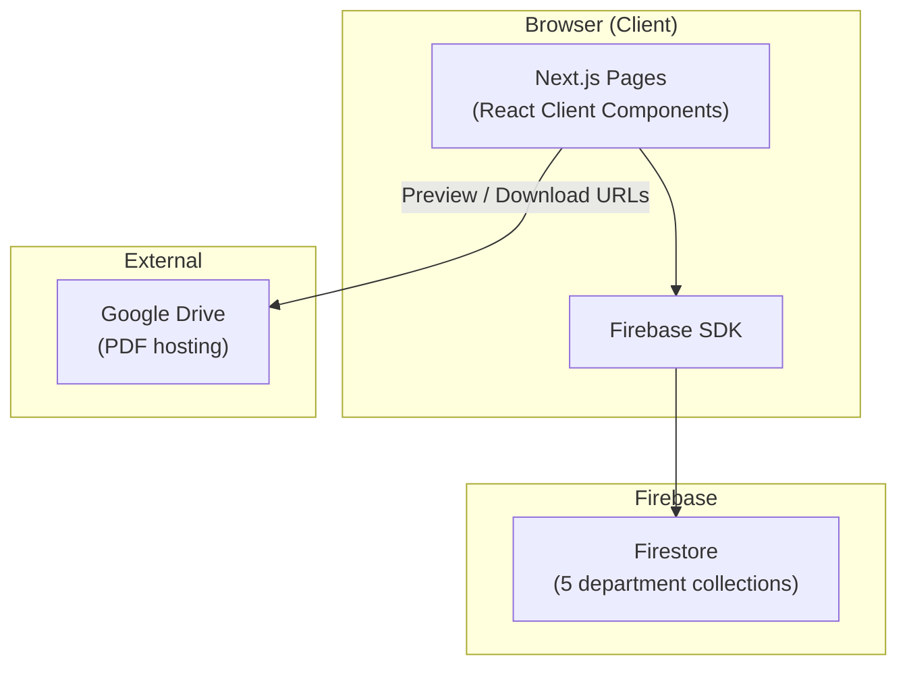

# ARICT Past Paper Portal

A web application for the **Association of Rajarata Information & Communication Technology (ARICT)** that lets students browse, search, and download past examination papers. Papers are stored in **Firebase Firestore** and linked via **Google Drive** URLs. A separate **admin** area allows staff to add new papers to the database.

---

## Table of Contents

- [Overview](#overview)
- [Features](#features)
- [Tech Stack](#tech-stack)
- [Architecture](#architecture)
- [Project Structure](#project-structure)
- [Routes & Pages](#routes--pages)
- [Data Model (Firestore)](#data-model-firestore)
- [How It Works](#how-it-works)
- [Environment Variables](#environment-variables)
- [Getting Started](#getting-started)
- [Admin Area](#admin-area)
- [Components](#components)
- [Styling & Design](#styling--design)
- [Fallback Data](#fallback-data)
- [Scripts](#scripts)
- [Deployment](#deployment)
- [Known Limitations](#known-limitations)
- [Contributing & Policies](#contributing--policies)
- [License](#license)

---

## Overview

This is a [Next.js](https://nextjs.org) App Router application (`src/app/`) that serves as a **past paper archive** for ARICT students. The public site provides:

- A searchable catalog of papers across five academic departments
- Department and examination-period browsing on the home page
- Individual paper detail pages with PDF preview and download
- Static informational pages (About, Faculty)

The **admin** section (`/admin/add-paper`) is a form for adding papers directly to Firestore. It is not linked in the main navigation and is not protected by authentication in the current codebase.

---

## Features

### Public site

| Feature | Description |
|--------|-------------|
| **Home** | Hero search, department cards with live paper counts from Firestore, browse-by-examination-period links |
| **Search / Papers** | Full paper list with text search, department/year filters, compact grid and list views |
| **Paper detail** | Metadata, Google Drive PDF preview in an iframe, download link, related papers |
| **About / Faculty** | Static content about ARICT and faculty support |
| **Search** | Query by course code, module name, department, instructor, or description |

### Admin (current)

| Feature | Route | Description |
|--------|-------|-------------|
| **Add paper** | `/admin/add-paper` | Form to create a new document in a department Firestore collection |

### Planned (not implemented yet)

- `/admin` dashboard
- Manage / edit / delete papers
- Admin authentication and route protection

---

## Tech Stack

| Layer | Technology |
|-------|------------|
| Framework | [Next.js 16](https://nextjs.org) (App Router) |
| UI | [React 19](https://react.dev) |
| Database | [Firebase Firestore](https://firebase.google.com/docs/firestore) |
| Icons | [Material Symbols](https://fonts.google.com/icons), [Lucide React](https://lucide.dev) |
| Fonts | Hanken Grotesk, Public Sans (Google Fonts) |
| Linting | ESLint with `eslint-config-next` |

There is **no** Firebase Authentication, API routes, or server-side data layer in the current setup. All Firestore reads and writes happen from **client components** in the browser.

---

## Architecture



**Data flow summary:**

1. On load, pages call `getDocs()` on each department collection in Firestore.
2. Documents are **normalized** in the client into a consistent paper shape (course code, title, year, etc.).
3. PDFs are not stored in Firebase; only a **Google Drive link** is saved. The app builds preview and download URLs from that link.
4. If Firestore fails, search and paper detail pages fall back to **local sample data** in `src/data/papers.js`.

---

## Project Structure

```
arict-paper-portal/
├── public/                    # Static assets (logo, icons)
├── src/
│   ├── app/                   # Next.js App Router pages
│   │   ├── layout.js          # Root layout (Header + main + Footer)
│   │   ├── globals.css        # Global styles and design tokens
│   │   ├── page.js            # Home
│   │   ├── about/page.js
│   │   ├── faculty/page.js
│   │   ├── search/page.js     # Papers listing & search
│   │   ├── paper/[id]/page.js # Single paper detail
│   │   └── admin/
│   │       └── add-paper/page.js
│   ├── components/            # Reusable UI components
│   ├── data/
│   │   ├── departments.js     # Department definitions
│   │   └── papers.js          # Local fallback papers + filter helpers
│   └── lib/
│       └── firebase.js        # Firebase app + Firestore init
├── .env.local                 # Firebase config (create locally; not committed)
├── env.local                  # Alternate local env filename (gitignored)
├── next.config.mjs
├── jsconfig.json              # Path alias: @/* → src/*
└── package.json
```

Path alias: imports like `@/components/Header` resolve to `src/components/Header`.

---

## Routes & Pages

### Public routes

| Route | File | Purpose |
|-------|------|---------|
| `/` | `src/app/page.js` | Home: search hero, departments, exam periods |
| `/search` | `src/app/search/page.js` | All papers; supports `?q=` and `?years=` |
| `/paper/[id]` | `src/app/paper/[id]/page.js` | Paper detail; supports `?dept=` for faster lookup |
| `/about` | `src/app/about/page.js` | About ARICT and the portal |
| `/faculty` | `src/app/faculty/page.js` | Faculty information |

**URL examples:**

- Search: `/search?q=Computing`
- Filter by exam period: `/search?years=October%20%7C%20November%202025`
- Paper detail: `/paper/abc123?dept=Computing`  
  (`id` is the Firestore document ID; `dept` is the collection/department name)

### Admin routes

| Route | File | Purpose |
|-------|------|---------|
| `/admin/add-paper` | `src/app/admin/add-paper/page.js` | Add a new paper to Firestore |

There is **no** `/admin` index page yet. Access add-paper by navigating directly to the URL (e.g. `http://localhost:3000/admin/add-paper`).

### Navigation

The header (`src/components/Header.js`) links to:

- Departments → `/`
- Papers → `/search`
- Faculty → `/faculty`
- About Us → `/about`

Login and Register buttons currently point to `/search` (placeholders; no auth implemented).

---

## Data Model (Firestore)

### Collections

Each **department name** is a **top-level Firestore collection**. Collection IDs must match exactly:

| Collection name (Firestore) | Slug (`departments.js`) |
|----------------------------|-------------------------|
| `Biological Sciences` | `biological-sciences` |
| `Chemical Sciences` | `chemical-sciences` |
| `Computing` | `computing` |
| `Health Promotion` | `health-promotion` |
| `Physical Sciences` | `physical-sciences` |

Each **paper** is one document inside the department collection. The document ID is auto-generated on create (`addDoc`).

### Document fields (admin create)

When adding a paper via `/admin/add-paper`, these fields are written:

| Field | Type | Required | Example |
|-------|------|----------|---------|
| `subject code` | string | Yes | `ICT3214` |
| `subject name` | string | Yes | `Mobile Application Development` |
| `year` | string | Yes | `October \| November 2025` |
| `department` | string | Yes | `Computing` (same as collection name) |
| `instructor` | string | No | `Ms. A.K.N.L. Aththanagoda` |
| `drive link` | string | No | `https://drive.google.com/file/d/...` |
| `createdAt` | timestamp | Auto | Server timestamp on create |

### Field aliases (read path)

The app tolerates **multiple field names** when reading from Firestore (legacy or inconsistent data). Examples:

| Normalized use | Accepted source fields |
|----------------|------------------------|
| Course code | `subject code`, `subjectCode`, `courseCode` |
| Title | `subject name`, `subjectName`, `title` |
| Drive link | `drive link`, `driveLink` |
| Year / exam period | `year`, `Year`, `exam period`, `examination period` |
| Instructor | `instructor`, `Instructor`, `lecturer`, `lecturer name`, and similar variants |

Optional fields used when present: `description`, `semester`, `duration`, `fileSize`, `difficulty`, `type`, `isRestricted`.

### Normalized paper object (client)

After fetching, papers are shaped roughly as:

```js
{
  id: "Computing-abc123",      // composite: department-docId
  docId: "abc123",             // Firestore document ID
  courseCode: "ICT3214",
  title: "Mobile Application Development",
  description: "",
  year: "October | November 2025",
  department: "Computing",
  departmentFull: "Computing",
  instructor: "...",
  driveLink: "https://drive.google.com/...",
  semester, duration, fileSize, difficulty, type, isRestricted
}
```

---

## How It Works

### Home page (`/`)

1. Loads department metadata from `src/data/departments.js`.
2. For each department, runs `getDocs(collection(db, dept.name))` to count papers and collect unique `year` values.
3. Renders `DepartmentCard` links to `/search?q={departmentName}`.
4. Renders `BrowseByExamPeriod` links to `/search?years={period}`.

### Search page (`/search`)

1. Fetches all documents from all five department collections in parallel.
2. Normalizes each document into the paper object shape.
3. Applies:
   - Text filter from `?q=` via `filterPapers()` in `src/data/papers.js`
   - Department filter from sidebar state
   - Year filter from `?years=` (comma-separated in URL) or sidebar
4. Displays results as compact cards (`PaperCard`) or list rows (`PaperListItem`).
5. On Firestore error: falls back to local `papers` array and shows a note.

### Paper detail (`/paper/[id]`)

1. Reads `id` from the URL and optional `dept` from `?dept=`.
2. If `dept` is set, fetches `doc(db, dept, id)` directly.
3. Otherwise searches all department collections for a matching document ID.
4. Builds Google Drive **preview** URL (`.../preview`) and **download** URL (`uc?export=download&id=...`).
5. Loads up to 3 related papers from the same department.
6. On failure: falls back to `getPaperById()` from local data.

### Google Drive link handling

Shared logic (in admin, paper detail, and `PaperCard`):

1. **Extract file ID** from URLs like `/d/{id}/` or `?id={id}`.
2. **Preview:** `https://drive.google.com/file/d/{id}/preview`
3. **Download:** `https://drive.google.com/uc?export=download&id={id}`
4. Direct `.pdf` URLs are supported for preview where applicable.

Files must be shared appropriately on Google Drive (e.g. “Anyone with the link”) for preview/download to work in the browser.

### Admin add paper (`/admin/add-paper`)

1. Client form collects subject code, name, year, department, instructor, drive link.
2. On submit, calls `addDoc(collection(db, department), payload)` with `serverTimestamp()` for `createdAt`.
3. Shows inline success/error status; resets form on success.
4. Live PDF preview in the form uses the same Drive URL helpers.

**Security note:** There is no login or middleware. Anyone who knows the URL can add papers if Firestore security rules allow writes. Restrict writes in the [Firebase Console](https://console.firebase.google.com) for production.

---

## Environment Variables

Firebase is configured via **public** env vars (prefixed with `NEXT_PUBLIC_` so they are available in the browser).

Create a file named **`.env.local`** in the project root (recommended; Next.js loads this automatically):

```env
NEXT_PUBLIC_FIREBASE_API_KEY=your_api_key
NEXT_PUBLIC_FIREBASE_AUTH_DOMAIN=your_project.firebaseapp.com
NEXT_PUBLIC_FIREBASE_PROJECT_ID=your_project_id
NEXT_PUBLIC_FIREBASE_STORAGE_BUCKET=your_project.appspot.com
NEXT_PUBLIC_FIREBASE_MESSAGING_SENDER_ID=your_sender_id
NEXT_PUBLIC_FIREBASE_APP_ID=your_app_id
```

Values come from **Firebase Console → Project settings → Your apps → Web app config**.

| File | Notes |
|------|--------|
| `.env.local` | Standard Next.js local env file (ignored by git via `.env*`) |
| `env.local` | Also listed in `.gitignore`; use `.env.local` for Next.js to load vars automatically |

**Do not commit** real credentials. Copy from Firebase Console for each environment.

Initialization lives in `src/lib/firebase.js`:

```js
import { initializeApp, getApps, getApp } from "firebase/app";
import { getFirestore } from "firebase/firestore";
// ... reads process.env.NEXT_PUBLIC_FIREBASE_*
export const db = getFirestore(app);
```

---

## Getting Started

### Prerequisites

- [Node.js](https://nodejs.org) 18+ (LTS recommended)
- npm (or yarn / pnpm / bun)
- A Firebase project with Firestore enabled
- Firestore collections created for each department name (collections can be empty initially)

### Install and run

```bash
# Clone the repository
git clone <repository-url>
cd arict-paper-portal

# Install dependencies
npm install

# Add Firebase config (see Environment Variables)
# Create .env.local with your NEXT_PUBLIC_FIREBASE_* values

# Start development server
npm run dev
```

Open [http://localhost:3000](http://localhost:3000).

### Production build

```bash
npm run build
npm start
```

Set the same `NEXT_PUBLIC_FIREBASE_*` variables in your hosting provider (e.g. Vercel project settings).

---

## Admin Area

### Access

| URL (local) | Action |
|-------------|--------|
| [http://localhost:3000/admin/add-paper](http://localhost:3000/admin/add-paper) | Open the add-paper form |

The admin UI uses the same global layout (public header and footer) as the rest of the site.

### Add a paper

1. Open `/admin/add-paper`.
2. Fill required fields: Subject Code, Subject Name, Year, Department.
3. Optionally add Instructor and a Google Drive link.
4. Use **PDF Preview** to verify the Drive link.
5. Click **Add Paper** — document is created in the selected department collection.

### Firestore setup for admin

Ensure your Firestore rules match your security needs. For development only, rules might allow open read/write; for production, restrict `write` to authenticated admins.

Example (conceptual — adjust for your project):

```
rules_version = '2';
service cloud.firestore {
  match /databases/{database}/documents {
    match /{department}/{paperId} {
      allow read: if true;
      allow write: if false; // tighten before production
    }
  }
}
```

---

## Components

| Component | Role |
|-----------|------|
| `Header` | Top navigation, mobile menu |
| `Footer` | Branding, department links, social placeholders |
| `SearchBar` | Hero and inline search; navigates to `/search?q=` |
| `DepartmentCard` | Department tile with paper count; links to search |
| `BrowseByExamPeriod` | Exam period cards; links to `/search?years=` |
| `FilterSidebar` | Department and year filters on search page |
| `PaperCard` / `PaperListItem` | Paper summary in grid or list view |
| `Pagination` | UI pagination (search page; total pages currently static) |
| `Breadcrumb` | Trail on paper detail page |
| `Chip` | Tags for year, department, type |
| `CopyLinkButton` | Copy current page URL |
| `RelatedPaperCard` | Related paper links on detail page |

---

## Styling & Design

- Global styles: `src/app/globals.css`
- CSS variables for colors, spacing, typography (e.g. `--color-primary`, `--color-surface`)
- Utility classes: `text-headline-lg`, `text-body-md`, `btn`, `btn-primary`, `card`, `container`
- `page.module.css` exists for the default Next.js template but the home page primarily uses global classes
- Responsive layout with a collapsible mobile nav in `Header`

---

## Fallback Data

`src/data/papers.js` contains a **static array** of sample papers used when:

- Firestore fetch fails on `/search`
- Paper is not found in Firestore on `/paper/[id]`

Helpers exported from `papers.js`:

- `getPaperById(id)`
- `getRelatedPapers(currentId, limit)`
- `filterPapers(sourcePapers, query, filters)`
- `searchPapers(query, filters)` — filters only the local array

Department definitions in `src/data/departments.js` are always used for UI labels and icons; counts on the home page come from Firestore when available.

---

## Scripts

| Command | Description |
|---------|-------------|
| `npm run dev` | Start dev server (default port 3000) |
| `npm run build` | Production build |
| `npm start` | Run production server after build |
| `npm run lint` | Run ESLint |

---

## Deployment

Well-suited for [Vercel](https://vercel.com) or any Node host that supports Next.js:

1. Connect the Git repository.
2. Set all `NEXT_PUBLIC_FIREBASE_*` environment variables in the dashboard.
3. Deploy; Vercel runs `next build` by default.

Ensure Firestore rules and Google Drive sharing are configured for production traffic.

---

## Known Limitations

| Area | Current behavior |
|------|------------------|
| **Authentication** | No login; admin routes are public |
| **Admin dashboard** | Only add-paper exists; no `/admin` home or manage/edit/delete UI |
| **Pagination** | Search page uses a fixed `totalPages={3}` placeholder |
| **PDF storage** | PDFs live on Google Drive only, not Firebase Storage |
| **Duplicate logic** | Drive URL helpers and instructor parsing repeated across several files |
| **Env file naming** | Project may use `env.local`; Next.js officially loads `.env.local` |
| **Header Login/Register** | Link to `/search`, not a real auth flow |

---

## Contributing & Policies

| Document | Purpose |
|----------|---------|
| [CONTRIBUTING.md](./CONTRIBUTING.md) | How to contribute |
| [CODE_OF_CONDUCT.md](./CODE_OF_CONDUCT.md) | Community standards |
| [CODE_OF_ETHICS.md](./CODE_OF_ETHICS.md) | Project ethics |
| [SECURITY.md](./SECURITY.md) | Reporting vulnerabilities |

---

## License

See [LICENSE](./LICENSE) in the repository root.

---

## Quick Reference

```text
Public:     /  /search  /paper/[id]  /about  /faculty
Admin:      /admin/add-paper
Firestore:  One collection per department name
PDFs:       Google Drive links → preview + download URLs
Config:     .env.local → NEXT_PUBLIC_FIREBASE_*
```

For questions about extending the admin area (dashboard, manage papers, auth), see the implementation plan discussed in project issues or team docs before building new routes under `src/app/admin/`.
